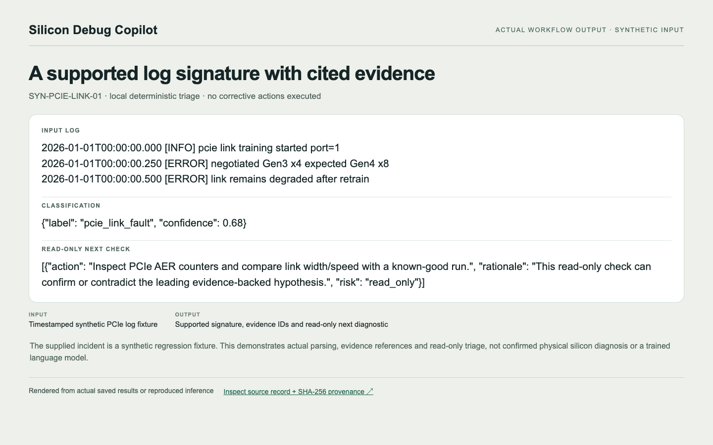
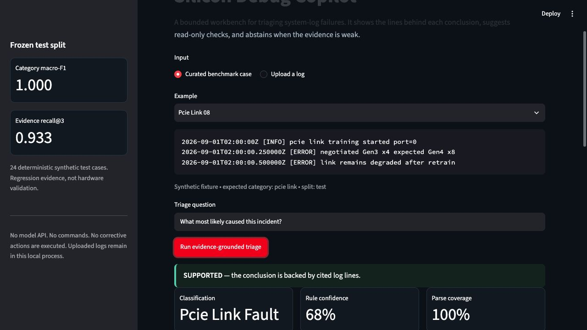
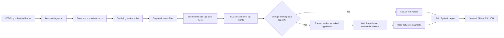

# Silicon Debug Copilot — Evidence-Grounded System-Log Triage

[Read the project report (PDF)](docs/PROJECT_REPORT.pdf) · [Explore the explanation and flow diagram](docs/PROJECT_REPORT.md)

## Actual output example



**Input:** Timestamped synthetic PCIe log fixture. **Output:** Supported signature, evidence IDs and read-only next diagnostic.

The supplied incident is a synthetic regression fixture. This demonstrates actual parsing, evidence references and read-only triage, not confirmed physical silicon diagnosis or a trained language model.

[Inspect the full output record and source hashes](docs/output-example.json) · [Open the standalone review page](docs/output-showcase.html) · [Original dataset](https://github.com/HarshSaand/silicon-debug-copilot/blob/main/evals/frozen_benchmark.jsonl)

### Reproduce this example

Follow the project setup/data steps below first. `--source` points to a reproduced project directory with its local data, saved predictions or checkpoints; use `.` when running in that directory. The exporter never silently invents missing inputs.

```bash
python docs/extract_showcase.py --source /path/to/reproduced/project
python docs/render_showcase.py
# Open docs/output-showcase.html directly, or capture the image with Chrome:
npm install --no-save playwright
node docs/capture_showcase.mjs
```

The JSON records the exact source-relative filenames, SHA-256 hashes and code revision. Rendering uses saved values; displayed decimals are rounded only for readability. Raw datasets and model checkpoints remain outside this documentation bundle.


Silicon Debug Copilot asks a narrow question: can a small, local workflow help an engineer triage a failed system-log run without inventing a cause?

The current prototype parses UTF-8 logs, looks for six supported signatures, gathers the matching log lines, and returns a structured hypothesis or abstains. It exposes the workflow through FastAPI and a Streamlit workbench. It does not diagnose silicon, inspect waveforms or registers, call a language model, or execute corrective actions.



The paired abstention example is saved at [`outputs/screenshots/abstained-ambiguous.jpg`](outputs/screenshots/abstained-ambiguous.jpg).

## Dataset at a glance

The diagnostic benchmark contains **80 synthetic incidents**, not real silicon failures. One incident is a short sequence of timestamped log messages with severity and line IDs, plus a reference category, anomaly/answerability labels, supporting evidence IDs and runbook IDs. It covers six supported fault families, ambiguous/mixed incidents and hard-normal examples that deliberately reuse fault vocabulary.

| Data component | Size | Use |
|---|---:|---|
| Synthetic training partition | 40 incidents | Development fixtures; no model is trained |
| Synthetic development partition | 16 incidents | Development checks |
| Frozen synthetic test partition | 24 incidents | Reported regression evaluation |
| Public HDFS structured sample | 2,000 log rows | Parser/ingestion smoke tests only |
| Public BGL structured sample | 2,000 log rows | Parser/ingestion smoke tests only |

The synthetic cases use JSONL (one incident per line); the public LogHub samples use structured CSV. The public samples are **not** additional diagnostic test incidents and do not validate the synthetic benchmark's root-cause labels. See [`DATA_PROVENANCE.md`](DATA_PROVENANCE.md) and [`evals/frozen_benchmark.jsonl`](evals/frozen_benchmark.jsonl).

## Technical snapshot

| Question | Implementation |
|---|---|
| What is the task? | Triage timestamped system logs into six supported signature families or abstain |
| What does the workflow inspect? | Parsed warning, error and fatal events plus a bounded surrounding timeline |
| What supports each conclusion? | Verbatim log evidence IDs and one retrieved local runbook |
| How is uncertainty handled? | Abstention on weak parse coverage, missing support or equally supported categories |
| What actions can it take? | None; it returns read-only diagnostic suggestions only |
| Can another user test it? | Yes; bundled cases and arbitrary UTF-8 `.log` or `.txt` uploads work locally through Streamlit or FastAPI |
| What is the operational boundary? | Signature triage and investigation support, not physical root-cause diagnosis |

## System flow

```text
UTF-8 system log
       |
       v
size, line-count and encoding checks
       |
       v
timestamp/severity parsing + stable evidence IDs
       |
       v
warning/error/fatal event filter
       |
       v
signature rules + BM25 evidence retrieval
       |
       v
support and ambiguity checks
       |
       +--------------------------+
       |                          |
       v                          v
supported signature          safe abstention
       |                          |
       v                          |
runbook retrieval                |
       +------------+-------------+
                    |
                    v
strict report validation -> UI / API / JSON
```

## Architecture



### Pre-processing

The ingestion layer accepts UTF-8 text up to 2 MB and 20,000 non-empty lines. The parser recognises common timestamp and severity forms, normalises severity to `DEBUG`, `INFO`, `WARNING`, `ERROR` or `FATAL`, preserves the original line and assigns a stable `log:` evidence ID. Parse coverage records how much of the upload had explicit structure. The workflow then restricts diagnosis to warning, error and fatal events so benign informational text containing words such as “timeout” does not become fault evidence.

### Detection and retrieval

This version deliberately does **not** use a trained model or an LLM. It implements six auditable signature rules for PCIe/link faults, memory/ECC alerts, thermal throttling, firmware-driver mismatch, device reset and timeout. Matching terms identify candidate families; deterministic BM25 ranks the relevant events. Timeline expansion adds neighbouring lines around the strongest evidence, while a second BM25 index retrieves one locally reviewed synthetic runbook. The system never generates an evidence ID or cites a log line that was not present in the parsed incident.

### Decision and post-processing

Candidate families are ranked by the number of distinct supporting events. The workflow abstains when parse coverage is below 20%, no supported signature appears, the two leading categories have equal support, or the leading category has fewer than two supporting events. For a supported case, it builds one bounded hypothesis, a heuristic rule-confidence score and one read-only diagnostic suggestion. Pydantic then validates field types, list limits, the read-only risk value and every cited evidence reference before the result can reach Streamlit, FastAPI or the downloadable JSON record.

This post-processing is intentionally conservative: the confidence value is a rule-derived ranking aid, not a calibrated probability, and no command or remediation is executed.

## What works today

- bounded parsing for timestamped or severity-tagged text logs
- six supported signature families: PCIe/link, memory/ECC, thermal, firmware/driver mismatch, device reset, and timeout
- deterministic BM25 search over the supplied log lines and seven reviewed local runbooks
- structured reports with resolvable evidence IDs
- abstention when parsing coverage or supporting evidence is insufficient
- read-only diagnostic suggestions
- an in-memory FastAPI service, a Streamlit workbench, and JSON output
- a frozen, versioned synthetic benchmark plus a transparent keyword baseline

## Measured result, with context

The repository saves both a transparent keyword baseline in [`evals/baseline_results.json`](evals/baseline_results.json) and the integrated deterministic workflow in [`evals/core_results.json`](evals/core_results.json):

| Measure | Keyword baseline | Integrated workflow |
|---|---:|---:|
| Test cases | 24 | 24 |
| Category macro-F1 | 0.833 | 1.000 |
| Anomaly recall | 1.000 | 1.000 |
| Evidence recall@3 | 0.800 | 0.933 |
| Citation precision | 1.000 | 1.000 |
| Schema success | 1.000 | 1.000 |
| Invented evidence IDs | 0 | 0 |

These numbers are contract and regression evidence on deterministic generated fixtures. The 80-case benchmark now includes category-explicit anomalies, ambiguous mixed cases and hard-normal cases that reuse fault vocabulary. Even so, the fixtures remain synthetic and closely coupled to the supported rule families. The integrated result verifies the parser, workflow adapter, evidence mapping and abstention path on this narrow benchmark; it does not establish real-hardware generalization. See [the benchmark note](docs/benchmark.md) and [the saved report](outputs/report.md).

## Requirements

- Python 3.10 or newer
- About 500 MB of free space for the virtual environment and dependencies
- A modern browser for the Streamlit interface
- No GPU, model checkpoint, API key or external database
- Internet access only during dependency installation; runtime analysis is local

The repository already contains its small synthetic benchmark, local runbooks and two public 2,000-row LogHub samples. A separate dataset download is not required to launch the demonstration.

## Run on macOS or Linux

```bash
git clone https://github.com/HarshSaand/silicon-debug-copilot.git
cd silicon-debug-copilot
python3 -m venv .venv
source .venv/bin/activate
python -m pip install --upgrade pip
python -m pip install -e '.[test]'
streamlit run app.py
```

Open the local address printed by Streamlit, normally `http://localhost:8501`. Choose a bundled example or select **Upload a log**.

## Run on Windows PowerShell

```powershell
git clone https://github.com/HarshSaand/silicon-debug-copilot.git
cd silicon-debug-copilot
py -3.12 -m venv .venv
.\.venv\Scripts\Activate.ps1
python -m pip install --upgrade pip
python -m pip install -e ".[test]"
streamlit run app.py
```

If PowerShell blocks activation, run `Set-ExecutionPolicy -Scope Process -ExecutionPolicy Bypass` in that terminal and activate the environment again.

## Test your own log

In the Streamlit workbench:

1. Select **Upload a log**.
2. Choose a UTF-8 `.log` or `.txt` file.
3. Keep or edit the triage question.
4. Select **Run evidence-grounded triage**.
5. Inspect the classification, cited log lines, runbook evidence and read-only next check.
6. Open **Structured report** to inspect or download the JSON record.

Inputs are limited to 2 MB and 20,000 non-empty lines. A custom log needs recognisable severity markers and at least two supporting events from one implemented family. Unsupported or ambiguous inputs intentionally return an abstention instead of a guessed diagnosis.

## Validate the installation

Run all automated tests:

```bash
python -m pytest
```

Run one local triage case from the command line:

```bash
python - <<'PY'
from silicon_debug.parsers import parse_log
from silicon_debug.workflow import TriageWorkflow

text = """2026-01-01T00:00:01Z [ERROR] PCIE AER completion timeout
2026-01-01T00:00:02Z [ERROR] PCIE link down"""
incident = parse_log(text, "readme-demo", "demo.log")
print(TriageWorkflow().run(incident).model_dump_json(indent=2))
PY
```

Run one case from the command line:

```bash
python scripts/run_case.py SYN-PCIE-LINK-08 --core
```

## Run the API

```bash
uvicorn silicon_debug.api:app --app-dir src --reload
```

Then upload and triage a log:

```bash
curl -s -F 'file=@incident.log' http://localhost:8000/v1/incidents
curl -s -X POST http://localhost:8000/v1/incidents/INCIDENT_ID/triage \
  -H 'content-type: application/json' \
  -d '{"question":"What failed?"}'
```

The API is then available at `http://127.0.0.1:8000`; interactive OpenAPI documentation is available at `http://127.0.0.1:8000/docs`.

## Run with Docker

```bash
docker compose up --build
```

Docker Compose starts the Streamlit workbench on `http://localhost:8501` and the FastAPI service on `http://localhost:8000`. Docker is optional; the Python setup above is sufficient.

## Reproduce the frozen benchmark

```bash
python scripts/generate_incidents.py
python scripts/build_index.py
python scripts/evaluate.py --split test --output evals/baseline_results.json
python scripts/evaluate.py --split test --core --output evals/core_results.json
```

The benchmark file is frozen by [`evals/frozen_benchmark.sha256`](evals/frozen_benchmark.sha256). Do not tune rules or thresholds against the test cases and then continue to call the split frozen.

## Repository map

```text
app.py                       Streamlit workbench
config/default.yaml          benchmark and acceptance settings
data/runbooks/               local, synthetic diagnostic notes
data/sample/                 generated incidents and runbook index
evals/                       frozen benchmark, hash, thresholds, results
scripts/                     generation, indexing, evaluation, case runner
src/silicon_debug/           parser, schemas, tools, workflow and API
tests/                       unit, API, workflow and benchmark checks
docs/                        architecture, evaluation and demo notes
outputs/                     concise measured-results report and figures
```

## What is not connected yet

I kept these gaps explicit because they materially change what the project can claim:

- Runbook retrieval returns one top document; runbook relevance is not independently scored by the current metrics.
- The integrated benchmark adapter maps generated cases into the runtime workflow, but anomalous cases still use category-explicit vocabulary close to the rules.
- The `question` field is accepted by the API but does not change the deterministic rule path.
- State is held in process memory; incidents and traces disappear on restart and are not suitable for multiple workers.
- Confidence is a rule-derived score, not a calibrated probability.
- The benchmark is synthetic and lexically bounded. It does not measure behavior on unseen products, real DV logs, post-silicon telemetry, or naturally occurring multi-fault incidents.

## Safety and data handling

- Uploaded logs are limited to UTF-8 text, 2 MB and 20,000 non-empty lines.
- Suggested diagnostics are read-only by schema. No action is executed.
- Reports cannot cite an evidence ID that is absent from the returned evidence list.
- This prototype has no authentication, persistence, encryption or redaction layer. Do not expose it publicly or upload confidential logs.
- Treat text inside logs and runbooks as untrusted data. A production system would need explicit prompt-injection defenses before adding an LLM.

Dataset details and attribution are in [`DATA_PROVENANCE.md`](DATA_PROVENANCE.md). The architecture and next engineering steps are described in [`docs/architecture.md`](docs/architecture.md).

## License

Code and original documentation in this repository are released under the [MIT License](LICENSE). Downloaded upstream data remains subject to its own terms.
