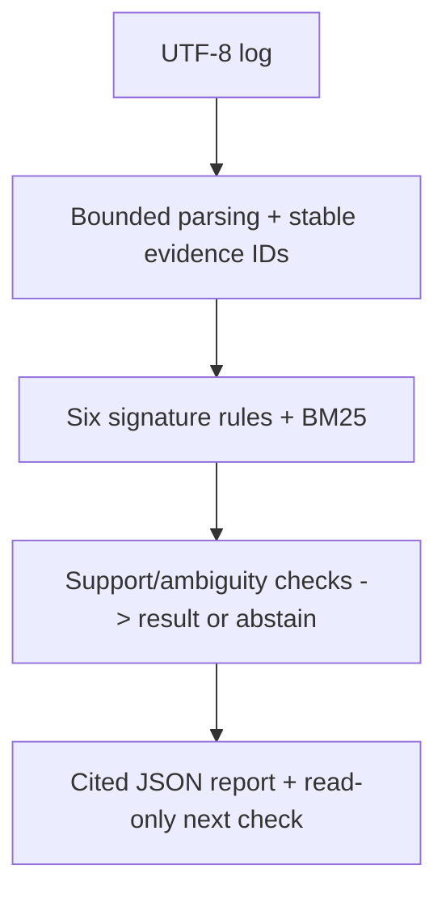

# Silicon Debug Copilot

Project report | Harsh Saand | 22 September 2026

## The problem

A system log can contain alarming words without enough evidence for a useful diagnosis. This workflow gathers explicit supporting lines and either returns one supported signature or abstains.

## What a user gets

The engineer receives a signature hypothesis, cited log lines, a retrieved runbook and a read-only next check through the UI, API or JSON output.

## Practical value

The value is traceable, bounded triage. The quantitative results are synthetic regression evidence, not confirmed silicon fault diagnosis. The implementation uses deterministic rules and BM25, not an LLM.

## Logic and flow



<details>
<summary><strong>Dataset at a glance</strong></summary>

The diagnostic benchmark contains **80 synthetic incidents**, not real silicon failures. One incident is a short sequence of timestamped log messages with severity and line IDs, plus a reference category, anomaly/answerability labels, supporting evidence IDs and runbook IDs. It covers six supported fault families, ambiguous/mixed incidents and hard-normal examples that deliberately reuse fault vocabulary.

| Data component | Size | Use |
|---|---:|---|
| Synthetic training partition | 40 incidents | Development fixtures; no model is trained |
| Synthetic development partition | 16 incidents | Development checks |
| Frozen synthetic test partition | 24 incidents | Reported regression evaluation |
| Public HDFS structured sample | 2,000 log rows | Parser/ingestion smoke tests only |
| Public BGL structured sample | 2,000 log rows | Parser/ingestion smoke tests only |

The synthetic cases use JSONL (one incident per line); the public LogHub samples use structured CSV. The public samples are **not** additional diagnostic test incidents and do not validate the synthetic benchmark's root-cause labels. See [`DATA_PROVENANCE.md`](https://github.com/HarshSaand/silicon-debug-copilot/blob/91261067a9e1831e0eeaf6b2efb8115c2812684c/DATA_PROVENANCE.md) and [`evals/frozen_benchmark.jsonl`](https://github.com/HarshSaand/silicon-debug-copilot/blob/91261067a9e1831e0eeaf6b2efb8115c2812684c/evals/frozen_benchmark.jsonl).

</details>

<details>
<summary><strong>Technical snapshot</strong></summary>

| Question | Implementation |
|---|---|
| What is the task? | Triage timestamped system logs into six supported signature families or abstain |
| What does the workflow inspect? | Parsed warning, error and fatal events plus a bounded surrounding timeline |
| What supports each conclusion? | Verbatim log evidence IDs and one retrieved local runbook |
| How is uncertainty handled? | Abstention on weak parse coverage, missing support or equally supported categories |
| What actions can it take? | None; it returns read-only diagnostic suggestions only |
| Can another user test it? | Yes; bundled cases and arbitrary UTF-8 `.log` or `.txt` uploads work locally through Streamlit or FastAPI |
| What is the operational boundary? | Signature triage and investigation support, not physical root-cause diagnosis |

</details>

<details>
<summary><strong>Architecture</strong></summary>

### Pre-processing

The ingestion layer accepts UTF-8 text up to 2 MB and 20,000 non-empty lines. The parser recognises common timestamp and severity forms, normalises severity to `DEBUG`, `INFO`, `WARNING`, `ERROR` or `FATAL`, preserves the original line and assigns a stable `log:` evidence ID. Parse coverage records how much of the upload had explicit structure. The workflow then restricts diagnosis to warning, error and fatal events so benign informational text containing words such as “timeout” does not become fault evidence.

### Detection and retrieval

This version deliberately does **not** use a trained model or an LLM. It implements six auditable signature rules for PCIe/link faults, memory/ECC alerts, thermal throttling, firmware-driver mismatch, device reset and timeout. Matching terms identify candidate families; deterministic BM25 ranks the relevant events. Timeline expansion adds neighbouring lines around the strongest evidence, while a second BM25 index retrieves one locally reviewed synthetic runbook. The system never generates an evidence ID or cites a log line that was not present in the parsed incident.

### Decision and post-processing

Candidate families are ranked by the number of distinct supporting events. The workflow abstains when parse coverage is below 20%, no supported signature appears, the two leading categories have equal support, or the leading category has fewer than two supporting events. For a supported case, it builds one bounded hypothesis, a heuristic rule-confidence score and one read-only diagnostic suggestion. Pydantic then validates field types, list limits, the read-only risk value and every cited evidence reference before the result can reach Streamlit, FastAPI or the downloadable JSON record.

This post-processing is intentionally conservative: the confidence value is a rule-derived ranking aid, not a calibrated probability, and no command or remediation is executed.

</details>

<details>
<summary><strong>Measured result, with context</strong></summary>

The repository saves both a transparent keyword baseline in [`evals/baseline_results.json`](https://github.com/HarshSaand/silicon-debug-copilot/blob/91261067a9e1831e0eeaf6b2efb8115c2812684c/evals/baseline_results.json) and the integrated deterministic workflow in [`evals/core_results.json`](https://github.com/HarshSaand/silicon-debug-copilot/blob/91261067a9e1831e0eeaf6b2efb8115c2812684c/evals/core_results.json):

| Measure | Keyword baseline | Integrated workflow |
|---|---:|---:|
| Test cases | 24 | 24 |
| Category macro-F1 | 0.833 | 1.000 |
| Anomaly recall | 1.000 | 1.000 |
| Evidence recall@3 | 0.800 | 0.933 |
| Citation precision | 1.000 | 1.000 |
| Schema success | 1.000 | 1.000 |
| Invented evidence IDs | 0 | 0 |

These numbers are contract and regression evidence on deterministic generated fixtures. The 80-case benchmark now includes category-explicit anomalies, ambiguous mixed cases and hard-normal cases that reuse fault vocabulary. Even so, the fixtures remain synthetic and closely coupled to the supported rule families. The integrated result verifies the parser, workflow adapter, evidence mapping and abstention path on this narrow benchmark; it does not establish real-hardware generalization. See [the benchmark note](https://github.com/HarshSaand/silicon-debug-copilot/blob/91261067a9e1831e0eeaf6b2efb8115c2812684c/docs/benchmark.md) and [the saved report](https://github.com/HarshSaand/silicon-debug-copilot/blob/91261067a9e1831e0eeaf6b2efb8115c2812684c/outputs/report.md).

</details>

<details>
<summary><strong>What is not connected yet</strong></summary>

I kept these gaps explicit because they materially change what the project can claim:

- Runbook retrieval returns one top document; runbook relevance is not independently scored by the current metrics.
- The integrated benchmark adapter maps generated cases into the runtime workflow, but anomalous cases still use category-explicit vocabulary close to the rules.
- The `question` field is accepted by the API but does not change the deterministic rule path.
- State is held in process memory; incidents and traces disappear on restart and are not suitable for multiple workers.
- Confidence is a rule-derived score, not a calibrated probability.
- The benchmark is synthetic and lexically bounded. It does not measure behavior on unseen products, real DV logs, post-silicon telemetry, or naturally occurring multi-fault incidents.

</details>

<details>
<summary><strong>Run with Docker</strong></summary>

```bash
docker compose up --build
```

Docker Compose starts the Streamlit workbench on `http://localhost:8501` and the FastAPI service on `http://localhost:8000`. Docker is optional; the Python setup above is sufficient.

</details>

## Evidence and reproduction references

Source revision: 91261067a9e1831e0eeaf6b2efb8115c2812684c

- [README.md](https://github.com/HarshSaand/silicon-debug-copilot/blob/91261067a9e1831e0eeaf6b2efb8115c2812684c/README.md)
- [docs/output-example.json](https://github.com/HarshSaand/silicon-debug-copilot/blob/91261067a9e1831e0eeaf6b2efb8115c2812684c/docs/output-example.json)
- [evals/core_results.json](https://github.com/HarshSaand/silicon-debug-copilot/blob/91261067a9e1831e0eeaf6b2efb8115c2812684c/evals/core_results.json)
- [outputs/metrics.json](https://github.com/HarshSaand/silicon-debug-copilot/blob/91261067a9e1831e0eeaf6b2efb8115c2812684c/outputs/metrics.json)

This report describes the source and saved evidence at the revision above. Training and full benchmark runs were not repeated for this documentation release. Dataset, model and dependency licences remain separate from the project documentation.
