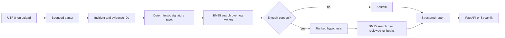

# Architecture and engineering boundaries

## Current request path

This is not an LLM architecture. `TriageWorkflow` iterates over six fixed rule families and uses bounded search tools to collect supporting log lines. The report schema prevents unknown fields and validates that every cited evidence ID is present in the response.

## Components

| Component | Current responsibility | Important boundary |
|---|---|---|
| `parsers.py` | parses timestamp/severity and assigns stable per-incident evidence IDs | accepts generic lines; parse coverage records explicit structure only |
| `tools.py` | search, filter, event-code summary and timeline windows | operates on one incident; tools are read-only |
| `retrieval.py` | deterministic in-memory BM25 | used for log and reviewed local runbook search; no semantic embeddings |
| `workflow.py` | signature matching, abstention and report assembly | fixed rules; no learned ranking or causal diagnosis |
| `schemas.py` | strict Pydantic contracts | confidence semantics are not statistically calibrated |
| `api.py` | ingest, triage and trace endpoints | in-memory state; no auth, database or multi-worker consistency |
| `observability.py` | records named workflow states | not a durable telemetry backend |

## Data boundaries

The frozen benchmark contains 80 deterministic synthetic incidents: ten fixtures for each of six supported fault families, ambiguous mixed behavior and hard-normal behavior. The test split contains 24 cases. Public LogHub samples are optional parser/ingestion material and are not used as diagnostic ground truth. The local runbooks are original synthetic notes, not vendor procedures.

See [`../DATA_PROVENANCE.md`](../DATA_PROVENANCE.md) for URLs, attribution and the benchmark construction rules.

## Recommended next increment

The next useful step is not a larger model. It is an honest end-to-end adapter and a harder benchmark:

1. Add lexically overlapping, missing-context, normal and multi-fault cases.
2. Score abstention precision/recall and false positives, not only anomaly recall.
3. Score runbook retrieval and document citation separately from log evidence.
4. Add a retrieval-only baseline and compare per-case error categories.
5. Persist incidents and traces before considering multiple API workers.
6. Calibrate or relabel the heuristic confidence score.

Only after that foundation is measured should an LLM or agent framework be added. The same evidence schema, read-only tool boundary and abstention tests should remain in force.
