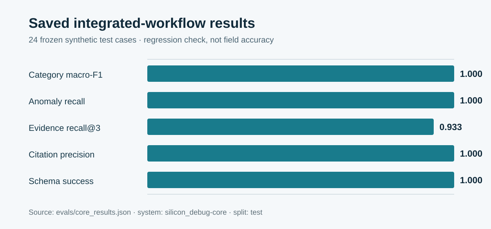

# Silicon Debug Copilot — measured prototype report

## Summary

I built a deterministic local prototype for evidence-linked system-log triage. It parses bounded text uploads, recognizes six supported signature families, returns verbatim evidence and read-only diagnostic suggestions, and abstains when support is weak.

The project name describes the intended direction. The current implementation is not a silicon-debugging system: it has no physical telemetry, register state, waveforms, vendor procedures or verified root-cause labels.

## Saved benchmark result

The repository saves the transparent keyword baseline and the integrated deterministic workflow:

| Split/system | Cases | Macro-F1 | Anomaly recall | Evidence recall@3 | Citation precision | Schema success | Invented IDs |
|---|---:|---:|---:|---:|---:|---:|---:|
| synthetic test / keyword baseline | 24 | 0.833 | 1.000 | 0.800 | 1.000 | 1.000 | 0 |
| synthetic test / integrated workflow | 24 | 1.000 | 1.000 | 0.933 | 1.000 | 1.000 | 0 |

The full benchmark contains 80 deterministic synthetic cases, including hard-normal fixtures that reuse fault terms and ambiguous mixed cases. Anomalous cases remain category-explicit and close to the implemented signatures. The integrated score verifies the parser, rules, adapter, evidence mapping and abstention path on generated inputs; it does not establish real-hardware generalization.

## Implemented safeguards

- hard upload and line-count limits
- strict Pydantic response schemas
- evidence-reference validation
- abstention for low parse coverage, missing signatures or fewer than two supporting events
- read-only diagnostic action schema
- no automatic remediation
- frozen benchmark hash

## Failures and limitations I would address next

1. The runtime retrieves one reviewed runbook, but the benchmark does not score whether it selected the right document.
2. The question supplied by a user does not alter the rule path.
3. The confidence value is heuristic and should not be displayed as a probability.
4. API state is process-local and disappears at restart.
5. The synthetic cases are short and lexically clean; they underrepresent multi-fault and missing-context failures.
6. Hard-normal cases are present, but the saved scorer does not report anomaly precision, specificity or false-positive rate.
7. There is no confidential-data redaction, authentication or access-control layer.

## Next evaluation

The next report should compare the runtime workflow, a retrieval-only baseline and any later model-assisted workflow on the same harder frozen benchmark. It should report category macro-F1, abstention precision/recall, evidence recall, citation precision, false positives on normal cases, per-case latency and an error taxonomy.
